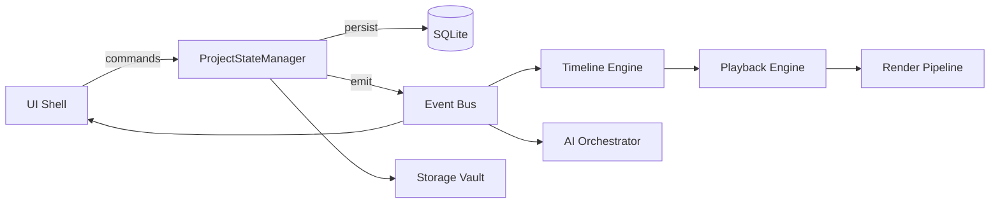

# CinemaStudio — Architecture

> Phase 0 foundation document. All modules must align with this architecture.
> Last updated: Phase 0

## Vision

CinemaStudio is a **mobile cinematic editing studio** — not a social editor, not a filter app.
The product feels like a premium film studio in your pocket: stable, fluid, guided, local-first.

## Architectural Principles

1. **Project State is sacred** — single source of truth, versioned, recoverable
2. **Video Engine is the core** — UI and AI orbit the engine, not the reverse
3. **Local-first** — core works offline; cloud is optional enhancement
4. **Modular & replaceable** — engines communicate via contracts and events
5. **Performance budgets from day one** — not optimized later
6. **Complexity internal, simplicity external**

## System Layers

```
┌─────────────────────────────────────────────────────────────┐
│  UI Layer (SwiftUI / Jetpack Compose)                       │
│  Premium cinematic UX — minimal, guided                     │
├─────────────────────────────────────────────────────────────┤
│  AI Orchestrator Layer                                      │
│  Workflow engine · Suggestions · Intent actions             │
├─────────────────────────────────────────────────────────────┤
│  Core Domain Layer                                          │
│  ProjectStateManager · Undo/Redo · Event Bus                │
├─────────────────────────────────────────────────────────────┤
│  Video Engine Layer (Rust)                                  │
│  Timeline · Playback · Render · GPU Scheduler · Media Index │
├─────────────────────────────────────────────────────────────┤
│  Storage Layer                                              │
│  SQLite · File vault · Proxies · Cache · Recovery           │
└─────────────────────────────────────────────────────────────┘
```

## Module Map

| Module | Responsibility | Phase | Language |
|--------|---------------|-------|----------|
| `project_state` | CRUD state, validation, migrations | 0–1 | Rust |
| `persistence` | SQLite, autosave, snapshots, recovery | 1 | Rust |
| `storage` | Media vault, proxies, cache cleanup | 1 | Rust |
| `event_bus` | Internal pub/sub, decoupling | 0–1 | Rust |
| `timeline_engine` | Tracks, clips, playhead, duration | 2 | Rust |
| `playback_engine` | Preview, scrub, frame pacing | 2 | Rust |
| `render_pipeline` | Export, background jobs, GPU queue | 3+ | Rust |
| `media_indexer` | Import, thumbnails, metadata | 1–2 | Rust |
| `ai_orchestrator` | Suggestions, workflow, actions | 4 | Rust + optional cloud |
| `device_profiler` | RAM/GPU/thermal tiers, adaptation | 5 | Native + Rust |
| `ios_shell` | SwiftUI app, FFI to engine | 1+ | Swift |
| `android_shell` | Compose app, FFI to engine | 1+ | Kotlin |

## Data Flow



### Golden Rule: No bypass

```
❌ UI → SQLite directly
❌ AI → Timeline directly
❌ Playback → Project files directly

✅ Everything → ProjectStateManager → Event Bus → Subscribers
```

## Project Directory Layout (on disk)

Each project is a self-contained folder:

```
MyFilm.csproj/
├── project.json          # Serialized Project State (canonical)
├── snapshots/            # Autosave snapshots (rotating)
│   ├── snap_001.json
│   └── snap_002.json
├── media/                # Original imported files (references)
│   └── index.json
├── proxies/              # Low-res editing proxies
├── cache/                # Temp renders, thumbnails
├── exports/              # Final output files
└── backups/              # Recovery backups
```

Extension `.csproj` = CinemaStudio Project (not MSBuild).

## Internal API Contracts

### ProjectStateManager

```rust
// Conceptual API — implemented in engine/src/project_state/

create_project(name, settings) -> ProjectState
open_project(path) -> Result<ProjectState>
save_project(state) -> Result<()>
apply_mutation(state, mutation) -> Result<ProjectState>
create_snapshot(state) -> Result<SnapshotId>
recover_from_snapshot(path, snapshot_id) -> Result<ProjectState>
validate_state(state) -> Result<ValidationReport>
migrate_state(state, target_version) -> Result<ProjectState>
```

### Event Bus

All state changes emit typed events. See [EVENT_BUS.md](./EVENT_BUS.md).

### FFI Boundary (Engine ↔ Mobile)

```
Mobile Shell  ←→  C ABI / UniFFI  ←→  Rust Engine
```

- Mobile never touches Rust internals
- All calls go through stable C-compatible API
- Versioned alongside `schemaVersion`

## Performance Budgets (MVP)

| Metric | Target | Measured in |
|--------|--------|-------------|
| Cold start | < 2s | Phase 1 gate |
| Open project | < 3s | Phase 1 gate |
| Autosave | < 500ms background | Phase 1 gate |
| Playback frame drop | < 5% | Phase 2 gate |
| UI freeze | < 100ms | Phase 2 gate |
| Export UI block | 0ms (fully async) | Phase 3 gate |
| RAM (mid device) | < 512MB active edit | Phase 5 gate |

## Device Tiers (Phase 5)

| Tier | RAM | GPU | Preview quality | Max proxy res |
|------|-----|-----|-----------------|---------------|
| Low | < 4GB | Basic | 480p | 720p |
| Mid | 4–8GB | Mid | 720p | 1080p |
| High | > 8GB | Flagship | 1080p | 1080p |

## Schema Versioning & Migrations

- `schemaVersion` in every project file
- Migration functions: `v1 → v2`, etc.
- Never delete fields without migration path
- Test migrations with real project fixtures

## Error Handling Policy

| Severity | Behavior |
|----------|----------|
| Recoverable | Retry + user notification |
| Data risk | Block save, create emergency snapshot |
| Critical | Safe shutdown, preserve temp state |
| Corruption | Auto-restore from last valid snapshot |

## Security (local)

- Project folders are user-owned
- No telemetry without opt-in (Phase 6)
- Cloud tokens stored in platform keychain only

## Dependencies (approved)

| Dependency | Purpose | Phase |
|------------|---------|-------|
| `serde` / `serde_json` | Serialization | 0 |
| `rusqlite` | SQLite | 1 |
| `uuid` | IDs | 0 |
| `chrono` | Timestamps | 0 |
| `thiserror` | Error types | 0 |
| `ffmpeg-next` | Media processing | 2+ |
| FFmpeg binary | Transcode/proxy | 2+ |

New dependencies require documentation in `docs/DEPENDENCIES.md` with justification.

## Risks & Mitigations

| Risk | Impact | Mitigation |
|------|--------|------------|
| Mobile video perf | Product failure | Native engine, proxies, device tiers |
| State corruption | User data loss | Snapshots, recovery-first, validation |
| Scope creep | Never ship | OUT_OF_SCOPE_MVP.md, phase gates |
| Cross-platform drift | 2x maintenance | Shared Rust core, thin native shells |
| AI unreliability | Bad UX | Rule-based orchestrator first, cloud optional |

## Future Extensions (post-MVP, not now)

- Multi-user collaboration
- Plugin system
- Cloud render farm
- Marketplace
- Multicam sync
- Advanced color pipeline

Each requires its own phase document and gate.
